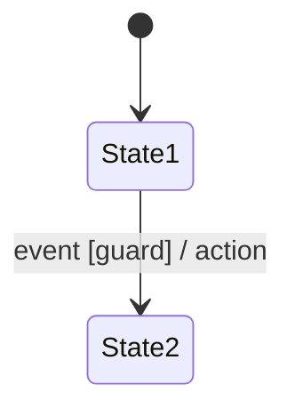
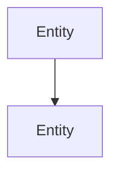

<!-- SPDX-License-Identifier: MIT -->
<!-- Copyright (c) PromptKit Contributors -->

---
name: behavioral-model
type: format
description: >
  Output format for reconstructed behavioral models. Presents state
  machines, control/signal flow, and implicit invariants as first-class
  outputs with diagrams, transition tables, and cross-references to
  the source artifact.
produces: behavioral-model
---

# Format: Behavioral Model

The output MUST be a structured behavioral model with the following
sections in this exact order. Do not omit sections — if a section has
no content, state "None identified" with a brief justification.

## Document Structure

````markdown
# <System/Component Name> — Behavioral Model

## 1. Overview
<2–4 sentences: what artifact was analyzed, what type of artifact it is
(code, schematic, netlist, configuration, protocol capture, firmware image, mixed),
and the scope of the reconstructed model.>

## 2. Artifact Summary
- **Artifact type**: <code | schematic | netlist | configuration |
  protocol capture | firmware image | mixed>
- **Source**: <file paths, document references, or capture identifiers>
- **Scope**: <what parts of the artifact were analyzed>
- **Limitations**: <what was NOT analyzed and why>

## 3. Entity Inventory

List every actor, component, or module identified in the artifact.

| ID | Entity | Type | Description | Source Location |
|----|--------|------|-------------|-----------------|
| E-001 | <name> | <component/function/IC/bus/config-key> | <role> | <file:line or sheet:ref> |

## 4. State Machines

For each state machine identified, provide:

### SM-<NNN>: <State Machine Name>

**Owner**: <which entity owns this state machine>
**Source**: <where in the artifact this state machine is defined or implied>
**Confidence**: High / Medium / Low
<If not High, explain what is uncertain.>

#### States

| State | Description | Entry Condition | Invariants While Active |
|-------|-------------|-----------------|------------------------|

#### Transition Table

| Current State | Event/Trigger | Guard | Action | Next State | Source |
|---------------|---------------|-------|--------|------------|--------|

#### State Diagram

<Text-based state diagram using Mermaid stateDiagram-v2 syntax:>



#### Completeness Notes
- **Undefined transitions**: <state × event combinations with no
  defined behavior — list each>
- **Terminal states**: <states with no outgoing transitions — are they
  intentional?>
- **Unreachable states**: <states with no incoming transitions>

## 5. Control / Signal Flow

Describe how entities interact and in what order.

### 5.1 Static Flow
<Call graph, signal routing, or dependency graph. For code: function
call hierarchy. For schematics: signal flow from input to output.
For configs: which settings affect which behaviors.>

Use text-based diagrams (Mermaid flowchart or ASCII).

### 5.2 Dynamic Flow
<Runtime or conditional flow that depends on state. For code: dispatch
through callbacks, vtables, event loops. For schematics: mux selection,
enable chains, power sequencing. For configs: feature flags that
activate different code paths.>

### 5.3 Flow Diagram



## 6. Implicit Invariants

Invariants the artifact maintains without explicitly documenting them.

### INV-<NNN>: <Invariant Name>

- **Type**: ordering | mutual-exclusion | timing | resource-lifecycle |
  value-constraint | dependency
- **Description**: <what the invariant guarantees>
- **Evidence**: <how this invariant was inferred from the artifact>
- **Enforcement**: <how the artifact enforces it — assertion, guard,
  hardware interlock, or not enforced at all>
- **Confidence**: High / Medium / Low
- **Risk if violated**: <what breaks if this invariant does not hold>

## 7. Undefined and Ambiguous Behavior

Catalog behaviors that the artifact leaves unspecified.

### UB-<NNN>: <Title>

- **Scenario**: <what input, event, or condition triggers undefined behavior>
- **Affected entities**: <which entities are involved>
- **Possible outcomes**: <what could happen — list plausible behaviors>
- **Risk**: <severity if this scenario occurs in production>
- **Source**: <where in the artifact the gap exists>

## 8. Cross-Reference Matrix

Map extracted model elements back to source artifact locations.

| Model Element | Type | Source Location | Notes |
|---------------|------|-----------------|-------|
| SM-001 | State machine | <file:line or sheet:ref> | |
| INV-001 | Invariant | <file:line or sheet:ref> | |
| UB-001 | Undefined behavior | <file:line or sheet:ref> | |

## 9. Revision History
<Table: | Version | Date | Author | Changes |>
````

## Formatting Rules

- State machines MUST include both a transition table AND a text-based
  diagram (Mermaid preferred, ASCII acceptable).
- Every state machine MUST have a completeness analysis (undefined
  transitions, terminal states, unreachable states).
- Every implicit invariant MUST state how it was inferred (evidence)
  and what happens if it is violated (risk).
- Every undefined behavior entry MUST list plausible outcomes, not just
  "behavior is undefined."
- Diagrams MUST use text-based formats (Mermaid, PlantUML, ASCII) for
  version control compatibility.
- Entity IDs (E-NNN), state machine IDs (SM-NNN), invariant IDs
  (INV-NNN), and undefined behavior IDs (UB-NNN) MUST be sequential
  and unique within the document.
- Confidence ratings MUST be included for state machines and invariants.
  Low confidence items MUST explain what additional information would
  increase confidence.
